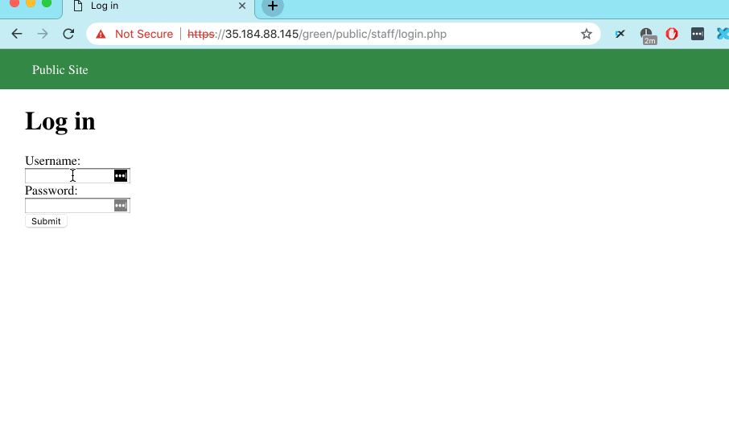
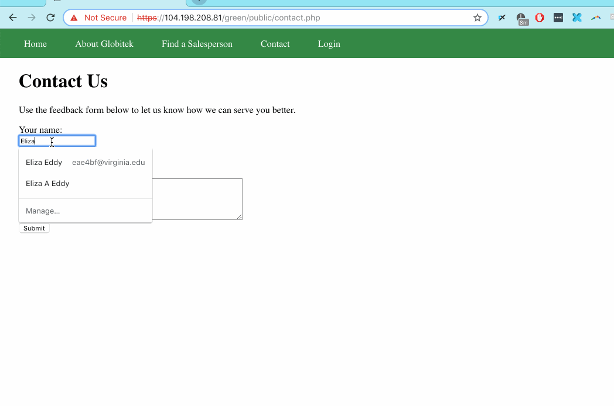
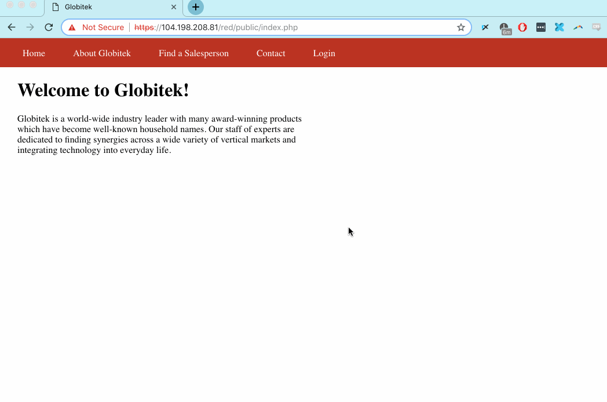

# Pentesting-Live-Targets

# Project 8 - Pentesting Live Targets

Time spent: **2** hours spent in total

> Objective: Identify vulnerabilities in three different versions of the Globitek website: blue, green, and red.

The six possible exploits are:
* Username Enumeration
* Insecure Direct Object Reference (IDOR)
* SQL Injection (SQLi)
* Cross-Site Scripting (XSS)
* Cross-Site Request Forgery (CSRF)
* Session Hijacking/Fixation

Each version of the site has been given two of the six vulnerabilities. (In other words, all six of the exploits should be assignable to one of the sites.)

## Blue

Vulnerability #1: SQL Injection

The input is not being sanitized before being used in an SQL query in the Blue website. The ID field in the URL will take the SQL injection, which in this case is ' or sleep(10)=0--'. This will just make the page sleep for 10 seconds, making it unresponsive.

Vulnerability #2: Session Hijacking/Fixation

## Green

Vulnerability #1: Username Enumeration

If the username is valid, the page will say "Log in was unsuccessful" in bold. However when a username that doesn't exist is entered, the message will be in normal text. 

Vulnerability #2: Cross-Site Scripting

For this one, the vulnerability was in the contact form. I submitted an XSS attack with an alert into the feedback, and then when the feedback page was reloaded, the alert came up.

## Red

Vulnerability #1:  Insecure Direct Object Reference

When you visit the "Find a Salesperson" tab in the red website, you can see that each person has a corresponding ID in the URL. By changing the ID number, you can access sensitive information like employees who are not public yet, or who have been fired. The Green and Blue websites prevent this by redirecting you to the main page if you try to change the ID number.

Vulnerability #2: Cross-Site Request Forgery

The Red site does not have CSRF protections. For this attack, I created an html file that when loaded would change the name of the person with id number 5. I submitted feedback with a link to this file and when the page was loaded in a new tab, the name was changed.

## Notes

Describe any challenges encountered while doing the work
